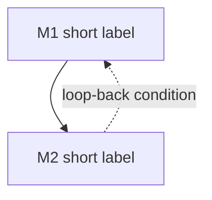

## Goal

The terminal state (or, for a maintenance loop, the control objective). Say why it is
long-horizon: what it waits on, what state it accumulates, how it loops.

## Outcome state

What you *hold* when done — documents, accounts, balances, relationships.

## Preconditions

- The starting state: what must already be true.

## Milestones

### M1 — Imperative title
- **Track:** A                       # parallel lane; shows the DAG is not linear
- **Gate:** what must be true to start this node (blocked-by which nodes / external wait).
- **Do:** `domain/recipe-id`, `domain/other-recipe-id`   # real recipe ids — validator checks these
- **Wait:** typical latency and what you are waiting on.
- **Verify:** the checkable predicate that this node is done.
- **Re-plan if:** the trigger that revises the plan or loops you back.

### M2 — …
- **Track:** B
- **Gate:** …
- **Do:** _none — planning/waiting node_             # a node may have no direct recipe
- **Wait:** …
- **Verify:** …
- **Re-plan if:** …

(>= 3 milestones.)

## Dependency graph

## Decision points

- Journey-level branch → the information that resolves it.

## Failure modes & recovery

- **F1 Name:** how a whole track fails → how to recover.

## Re-plan triggers

- When new information arrives, revise: list the conditions. (First-class for long-horizon tasks.)

## Verification

The terminal predicate for the whole journey, plus: each milestone's own **Verify** must have held.

## Variations

- Locale / jurisdiction differences (mandatory — journeys vary far more than recipes).

## Safety & privacy

Money at stake, irreversible commitments, identity/documents exposed, which steps need confirmation.
