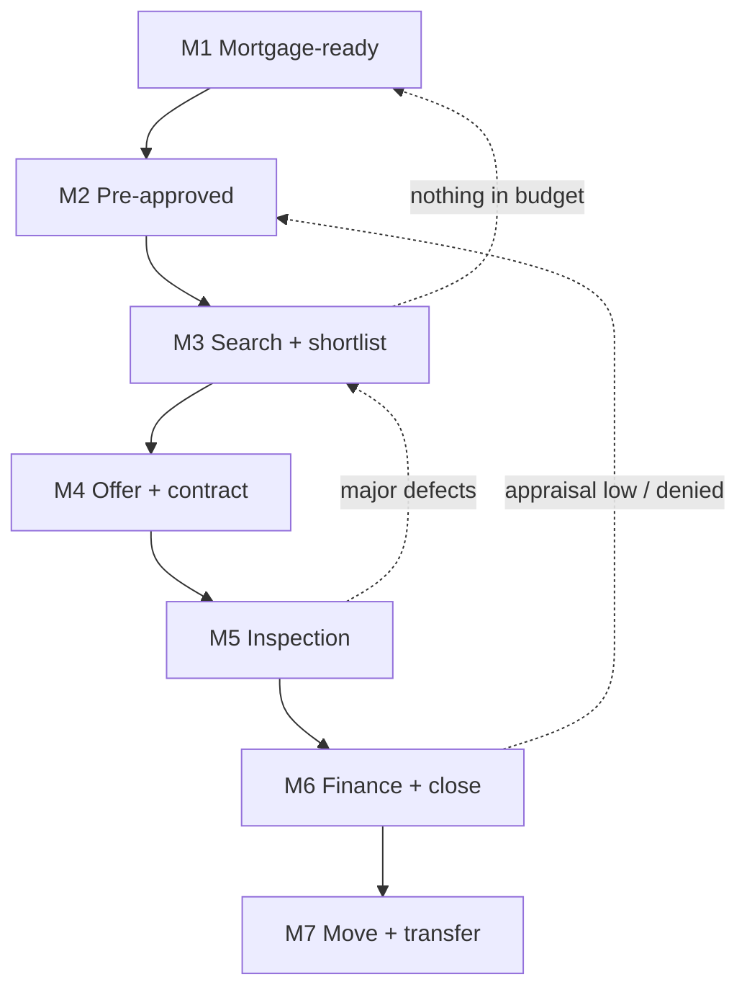

## Goal

Go from "I want to buy" to holding the keys and a recorded deed, without over-committing before
financing and inspection are certain. This is long-horizon: it is gated on a lender's underwriting
clock, an appraisal, an inspection contingency window, and a fixed closing date — and several steps
are irreversible (earnest money, the purchase agreement, closing).

## Outcome state

When done you hold: keys, a recorded deed in your name, a funded mortgage on terms you understood,
active utilities, and your address updated everywhere.

## Preconditions

- The rent-vs-buy decision is made and buying is the goal.
- You have, or can build, a down payment and stable income a lender will document.

## Milestones

### M1 — Get mortgage-ready
- **Track:** A (month 0, may take months)
- **Gate:** none — start here.
- **Do:** `finance/create-a-simple-budget`, `finance/save-for-a-big-purchase`,
  `finance/check-your-credit-report`, `finance/understand-your-credit-score`,
  `finance/build-credit-from-scratch`
- **Wait:** credit improvement and saving take months — this is usually the longest node.
- **Verify:** you know your price ceiling, your down-payment target is saved, and your credit
  score band is documented.
- **Re-plan if:** credit is too low or savings short → extend the timeline and prioritize
  building credit before touching M2.

### M2 — Get pre-approved
- **Track:** A (month 1)
- **Gate:** M1 (budget and credit known).
- **Do:** `finance/understand-a-loan-offer`, `finance/understand-apr`,
  `finance/read-a-mortgage-offer`, `finance/open-a-savings-account`
- **Wait:** a pre-approval letter takes 1–5 days and is valid ~60–90 days.
- **Verify:** you hold a written pre-approval stating a maximum loan amount and rate estimate.
- **Re-plan if:** the pre-approval is below what you need → return to M1 (save more or lower the
  price band).

### M3 — Search and shortlist
- **Track:** B (month 1–4)
- **Gate:** M2 (sellers expect a pre-approval before offers).
- **Do:** _none — search/touring node; compare against the M1 budget and M2 ceiling_
- **Wait:** market-dependent — weeks to months.
- **Verify:** a shortlisted property within budget that you want to offer on.
- **Re-plan if:** nothing fits the budget → widen area or adjust the band (loop to M1).

### M4 — Offer and go under contract
- **Track:** B (month 2–4)
- **Gate:** M3 (a property) and M2 (financing).
- **Do:** _none — negotiation node_ — ⚠ *Irreversible:* signing the purchase agreement and
  depositing earnest money commit you; confirm price, contingencies, and dates first.
- **Wait:** seller response in days.
- **Verify:** a signed purchase agreement and earnest money deposited into escrow.
- **Re-plan if:** you are outbid or the seller rejects → return to M3.

### M5 — Inspection and due diligence
- **Track:** C (month 3–5)
- **Gate:** M4 (under contract).
- **Do:** `housing/do-a-move-in-inspection`
- **Wait:** the inspection contingency window is typically 7–14 days.
- **Verify:** the inspection is reviewed and issues are negotiated or accepted; all contingencies
  are satisfied or explicitly waived.
- **Re-plan if:** major defects appear → renegotiate the price or exit under the contingency
  (return to M3).

### M6 — Finalize financing and close
- **Track:** C (month 4–6)
- **Gate:** M5 (contingencies cleared).
- **Do:** `finance/read-a-mortgage-offer`, `daily/get-a-document-notarized`
- **Wait:** underwriting takes 2–4 weeks; the closing date is fixed.
- **Verify:** ⚠ *Irreversible:* you sign at closing, funds transfer, and the deed is recorded in
  your name — you hold the keys.
- **Re-plan if:** the appraisal comes in below price or the loan is denied in underwriting →
  renegotiate the price or restart financing at M2.

### M7 — Move in and transfer your life
- **Track:** D (month 6+)
- **Gate:** M6 (you own it).
- **Do:** `housing/move-house`, `housing/set-up-utilities`, `housing/transfer-utilities-when-moving`,
  `housing/forward-your-mail`, `government/register-a-change-of-address`,
  `digital/update-your-address-across-accounts`
- **Wait:** utility activation can take days.
- **Verify:** utilities are on, mail is forwarded, and your address is updated across accounts and
  government records.
- **Re-plan if:** none — this is the closeout.

## Dependency graph

## Decision points

- **Fixed-rate vs adjustable, and points vs no points** → resolved by how long you'll hold and
  your rate outlook (see `finance/understand-apr`).
- **Waive the inspection to win a bid?** → almost never on an unfamiliar property; the contingency
  is your only clean exit.
- **Appraisal gap** → pay the difference in cash, renegotiate, or walk.

## Failure modes & recovery

- **F1 Pre-approval expires mid-search:** re-pull it before offering (rates/credit may have moved).
- **F2 Financing denied in underwriting:** the contingency protects your earnest money → exit and
  return to M2; never remove the financing contingency you can't cover in cash.
- **F3 Low appraisal:** renegotiate to the appraised value or cover the gap; do not assume the
  seller will drop.
- **F4 Inspection reveals a deal-killer:** exercise the inspection contingency and return to M3.

## Re-plan triggers

- Interest rates move materially → re-run affordability (M1) and re-shop the loan (M2).
- Your income or credit changes during the process → tell the lender immediately; underwriting
  re-checks at closing.
- The appraisal or inspection changes the economics → renegotiate or exit via the matching contingency.

## Verification

The journey succeeds when the deed is recorded in your name, the mortgage funded on terms you
understood, contingencies were cleared before you waived them, and M7's transfers are complete.
Each milestone's own **Verify** must have held — keys in hand while a financing contingency was
silently unmet is not success, it is exposure.

## Variations

- **US (default):** pre-approval → offer with contingencies → escrow → title/closing; appraisal and
  underwriting gate funding.
- **UK:** "offer accepted" is not binding until exchange of contracts; a survey replaces the US
  inspection and conveyancing solicitors handle closing — gazumping is the added risk.
- **Elsewhere:** substitute your notary/conveyancing system and deposit rules; the DAG and gates hold.

## Safety & privacy

The highest-stakes journey here: six figures and irreversible signatures. Never wire funds on
emailed instructions — closing-wire fraud is common; confirm account details by phone using a
number you looked up independently. Keep every disclosure, the contract, and the closing statement.
