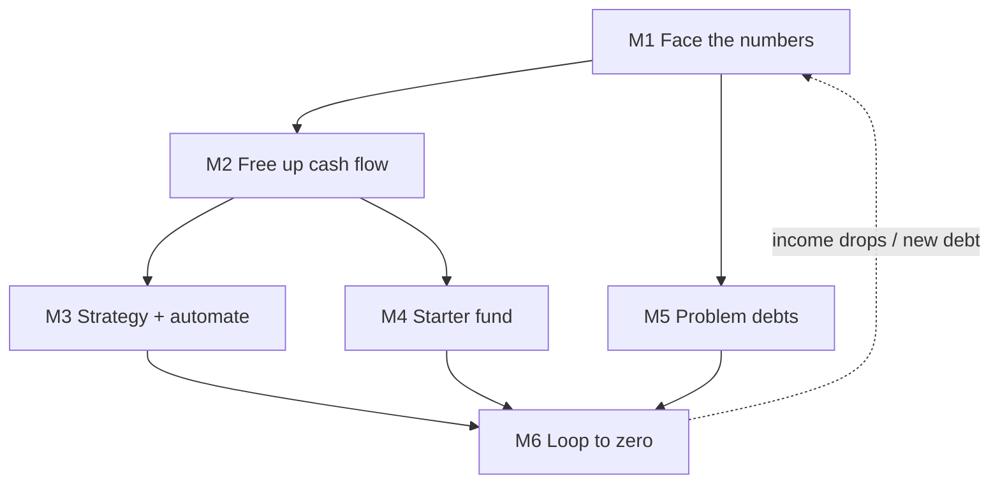

## Goal

Go from carrying high-interest debt to a zero (or controlled) balance, on a plan you can actually
sustain. This is long-horizon and, until the end, a **control loop, not a one-shot**: you set a
policy, run it monthly for months to years, and re-plan as balances, rates, and income change.

## Outcome state

When done you hold: a written picture of every debt, an automated payoff that beats minimums, a
starter emergency fund so surprises don't create new debt, resolved collections/medical items, and
a monthly balance that trends to zero.

## Preconditions

- You have decided to tackle the debt and can see your accounts.

## Milestones

### M1 — Face the numbers
- **Track:** A (week 0–1)
- **Gate:** none — start here.
- **Do:** `finance/check-your-credit-report`, `finance/check-your-bank-statement`,
  `finance/track-your-spending`, `finance/create-a-simple-budget`
- **Wait:** none.
- **Verify:** a written list of every debt (balance, APR, minimum payment) and your monthly
  surplus or shortfall figure.
- **Re-plan if:** there is no surplus → do M2 (cut costs) before any payoff plan.

### M2 — Free up cash flow
- **Track:** A (week 1–3)
- **Gate:** M1 (a budget).
- **Do:** `finance/cancel-a-forgotten-subscription`, `finance/cancel-a-gym-membership`,
  `finance/negotiate-a-bill`, `finance/avoid-overdraft-fees`
- **Wait:** cancellations are immediate; bill negotiations take days.
- **Verify:** your monthly surplus has increased by a measured amount you can direct at debt.
- **Re-plan if:** cash flow is still negative → the problem is income, not spending → pursue more
  income or hardship options before payoff (branch).

### M3 — Choose a strategy and automate
- **Track:** B (week 2)
- **Gate:** M1 (debt list) and M2 (a surplus).
- **Do:** `finance/make-a-debt-payoff-plan`, `finance/set-up-a-recurring-transfer`,
  `finance/round-up-your-savings`
- **Wait:** none.
- **Verify:** avalanche (highest APR first) or snowball (smallest balance first) chosen, and an
  automatic extra payment is scheduled to the target debt.
- **Re-plan if:** an interest rate changes or a new debt appears → re-rank the targets.

### M4 — Build a starter safety net
- **Track:** B (week 2–8, in parallel)
- **Gate:** M2 (a surplus).
- **Do:** `finance/build-an-emergency-fund`
- **Wait:** takes weeks to months to fund.
- **Verify:** a small starter emergency fund exists so a surprise expense doesn't create new debt.
- **Re-plan if:** the fund is spent → pause extra payoff and refill it first.

### M5 — Handle problem debts
- **Track:** C (as needed)
- **Gate:** any collections or disputed medical items on the M1 list.
- **Do:** `finance/contest-a-collections-notice`, `finance/negotiate-a-medical-bill`
- **Wait:** disputes and negotiations run 30–90 days.
- **Verify:** each collections/medical item is resolved, reduced, or on a written payment plan.
- **Re-plan if:** an item is re-sold or reappears → loop it back through M5.

### M6 — Run the loop to zero
- **Track:** D (month 3–36, maintenance loop)
- **Gate:** M3 active.
- **Do:** `finance/track-your-spending`, `finance/make-a-debt-payoff-plan`
- **Wait:** months to years.
- **Verify:** balances fall every month; when one debt hits zero, its payment rolls onto the next
  target (the accelerating part of the plan).
- **Re-plan if:** income drops or a new expense appears → rebuild the budget (M1) and adjust the plan.

## Dependency graph

## Decision points

- **Avalanche vs snowball** → avalanche saves the most interest; snowball's early wins help if you
  need momentum to stick with it.
- **Consolidate or balance-transfer?** → only if the new APR and fees genuinely lower total cost and
  you won't re-run up the freed cards.
- **Pay debt or fund the emergency account first?** → fund a small starter buffer first, or the next
  surprise puts you right back on the cards.

## Failure modes & recovery

- **F1 New debt during payoff:** a surprise expense hit the cards → that's what M4 prevents; refill
  the fund and resume.
- **F2 Minimums-only trap:** the automated extra payment (M3) is what breaks it — verify it's
  actually scheduled, not intended.
- **F3 Collections re-aged after payment:** re-dispute with "previously resolved, see agreement,"
  and get every settlement in writing before paying.
- **F4 Motivation collapse:** switch avalanche→snowball for visible wins, or shrink the plan to one
  target at a time.

## Re-plan triggers

- Income or expenses change → rebuild the budget (M1) and re-rank targets (M3).
- A rate rises (variable card/loan) → move it up the payoff order.
- A new debt or collections item appears → add it to M1's list and route to M5.
- A debt hits zero → roll its payment onto the next (M6 is where the plan accelerates).

## Verification

The journey succeeds when targeted balances reach zero (or a controlled, low-interest level), the
extra payment stayed automated throughout, a starter fund is intact, and no new high-interest debt
was added. Each milestone's **Verify** must have held — a zero card balance with the emergency fund
drained is fragile, not finished.

## Variations

- **US (default):** FCRA governs collections disputes; medical debt has specific protections and is
  often negotiable.
- **UK/EU:** debt advice charities and statutory options (e.g. a Debt Management Plan, or an IVA in
  the UK) change M5; regulated affordability rules apply.
- **Elsewhere:** substitute local consumer-credit and insolvency options; the budget→automate→loop
  structure holds.

## Safety & privacy

Money and credit standing are at stake, and some steps have lasting records (a settled-for-less debt
can show on your report; a formal insolvency has long consequences). Get every creditor agreement in
writing before paying. Beware "debt relief" companies that charge upfront and worsen your credit —
the free non-profit route usually dominates.
