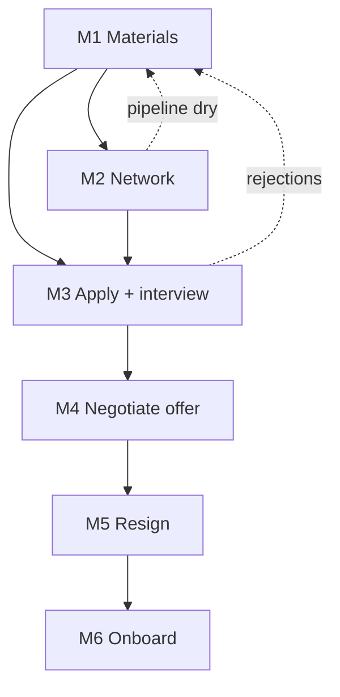

## Goal

Move from your current job to a better one without a gap and without burning bridges — materials
ready, a live pipeline, offers negotiated, and your resignation timed so it lands only *after* the
new offer is signed. This is long-horizon: it runs on other people's clocks (replies, multi-round
loops, ghosting) and re-plans constantly as feedback arrives.

## Outcome state

When done you hold: a signed offer you understand, a graceful exit from your old role with a notice
period and handover, references intact, and payroll/benefits set up at the new job.

## Preconditions

- You have decided to switch (or are seriously testing the market).
- You can interview discreetly while employed.

## Milestones

### M1 — Prep materials and positioning
- **Track:** A (week 0–2)
- **Gate:** none — start here.
- **Do:** `communication/write-a-cover-letter`, `communication/introduce-yourself-professionally`,
  `communication/write-a-linkedin-connection-note`, `communication/write-a-self-review`
- **Wait:** none.
- **Verify:** an updated resume, a tailorable cover-letter template, a current LinkedIn profile,
  and a one-line positioning statement for your target role.
- **Re-plan if:** you can't name a target role → do informational interviews (M2) before applying.

### M2 — Network and source leads
- **Track:** A (week 1–8, ongoing)
- **Gate:** M1 (materials ready to share).
- **Do:** `communication/ask-for-an-informational-interview`,
  `communication/write-a-networking-follow-up`, `communication/respond-to-a-recruiter`,
  `communication/ask-for-a-reference`
- **Wait:** replies take days to weeks; expect silence on most.
- **Verify:** a pipeline of several live leads and at least two references lined up.
- **Re-plan if:** the pipeline is dry after weeks → broaden roles/geography and revise M1 positioning.

### M3 — Apply and interview
- **Track:** B (week 2–10)
- **Gate:** M1 (materials) plus leads from M2.
- **Do:** `communication/follow-up-after-a-job-interview`
- **Wait:** multi-round loops over weeks; ghosting is normal — keep applying in parallel.
- **Verify:** at least one final-round or offer in hand.
- **Re-plan if:** consistent early-stage rejections → fix the resume/story (M1) or the targeting (M2).

### M4 — Evaluate and negotiate the offer
- **Track:** C (week 8–12)
- **Gate:** M3 (an offer).
- **Do:** `communication/negotiate-a-job-offer`, `communication/decline-a-job-offer-gracefully`,
  `finance/read-a-payslip`
- **Wait:** offer deadlines are days — ask for time if you need competing offers to land.
- **Verify:** ⚠ *Irreversible:* a signed offer whose comp, title, and start date you understand;
  other offers declined gracefully (you may want them later).
- **Re-plan if:** the offer is withdrawn or a lowball won't move → return to M3.

### M5 — Resign gracefully
- **Track:** D (week 12)
- **Gate:** M4 — a *signed* offer with a firm start date. Never resign before this.
- **Do:** `communication/write-a-resignation-letter`, `communication/quit-a-job-gracefully`
- **Wait:** your notice period (commonly two weeks).
- **Verify:** ⚠ *Irreversible:* resignation delivered, notice period set, and a handover plan agreed.
- **Re-plan if:** a counteroffer arrives → decide stay-or-go deliberately (it rarely fixes why you
  left); if the new offer is rescinded before you've resigned, pause M5 entirely.

### M6 — Onboard and set up
- **Track:** D (week 14+)
- **Gate:** M5 complete and the start date reached.
- **Do:** `communication/onboard-to-a-new-job`, `finance/set-up-direct-deposit`,
  `digital/set-up-an-email-signature`
- **Wait:** the first few weeks.
- **Verify:** payroll and direct deposit are set, systems access works, and 30-day goals are agreed.
- **Re-plan if:** a serious role mismatch surfaces → renegotiate scope early, while you have goodwill.

## Dependency graph

## Decision points

- **Take a counteroffer?** → usually no; it addresses pay but not the reasons you were leaving.
- **Disclose you're interviewing?** → generally not until you've signed, to protect against
  retaliation and a rescinded new offer.
- **Multiple offers landing apart in time** → ask the leading employer for a short extension rather
  than accepting then reneging.

## Failure modes & recovery

- **F1 Resigned before signing, offer falls through:** the worst case this journey exists to prevent
  — M5's gate is a signed offer for exactly this reason.
- **F2 Reference goes cold:** line up more than two (M2); confirm each is willing before listing them.
- **F3 Background/reference check surfaces a problem:** address it proactively with the employer
  before it derails the offer.
- **F4 Pipeline collapses after a layoff pushes many candidates in:** widen scope and lean on M2's
  network rather than cold applications.

## Re-plan triggers

- Repeated rejection at the same stage → the problem is that stage's materials/prep; fix it (M1/M3).
- A better offer appears mid-process → renegotiate or switch targets before signing (M4).
- Your current job situation changes (layoff, new manager) → re-time M5 and adjust urgency.

## Verification

The journey succeeds when you hold a signed offer you understand, you resigned only after signing,
your references and old-employer relationship are intact, and M6 setup is complete with no coverage
gap. Each milestone's **Verify** must have held — a new job started while payroll is unset, or a
bridge burned on the way out, is a partial failure.

## Variations

- **US (default):** at-will employment; two weeks' notice is customary, not required; benefits
  (health insurance) may lapse between jobs — check COBRA/marketplace timing.
- **EU/UK:** contractual notice periods are longer (1–3 months) and legally binding; garden leave is
  common — M5's wait node is much larger.
- **Elsewhere:** substitute local notice law and benefit-continuation rules; the DAG holds.

## Safety & privacy

Keep the search discreet: interview on personal devices and time, and don't post it where your
employer sees. Don't sign or resign under deadline pressure without reading the terms. Verify a new
employer is legitimate before sharing sensitive documents (bank details, ID) for onboarding.
