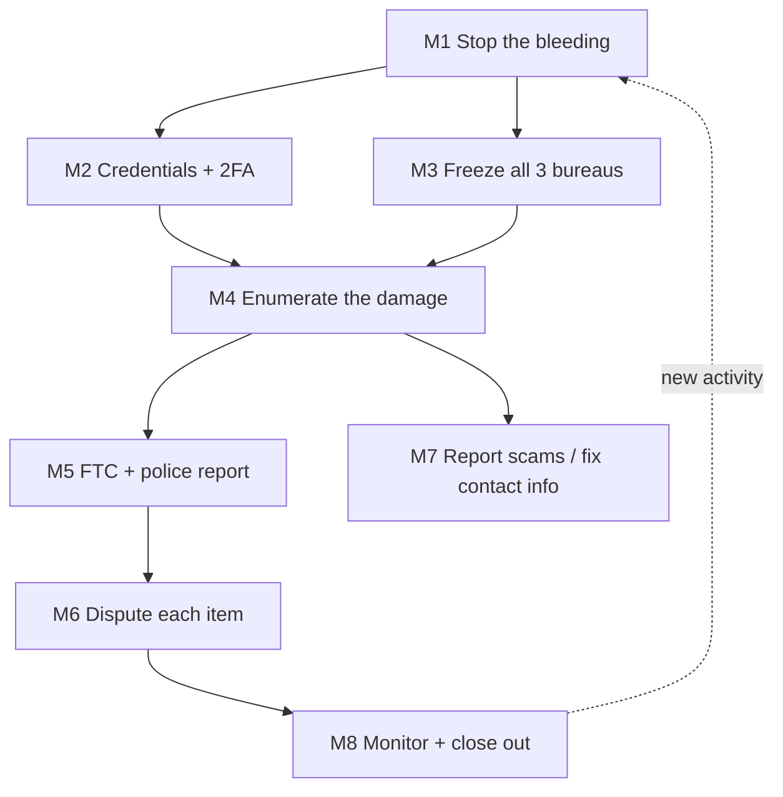

## Goal

Return from "someone is using my identity" to a fully secured, clean state: the fraud stopped,
your accounts locked down, an official record on file, every fraudulent item disputed and
removed, and monitoring in place so it does not silently resume. This is a long-horizon task —
it is gated on third-party clocks (card reissue, bureau responses, the ~30-day dispute window)
and it loops: new fraud surfacing weeks later reopens earlier milestones.

## Outcome state

When done you hold: a replaced card / recovered accounts on unique passwords + 2FA; a credit
freeze active at all three bureaus; an FTC Identity Theft Report and a police report number;
written confirmation that each fraudulent account, inquiry, and charge was blocked or deleted;
and a monitoring routine with an extended (7-year) fraud alert.

## Preconditions

- You have detected fraud: an unrecognized charge, a login/credit alert, a denied application,
  a bill or collections notice for something you did not open.
- You can still access your primary email and phone (if not, M2 comes first — see re-plan).

## Milestones

### M1 — Stop the bleeding on the known-compromised account
- **Track:** A (immediate, day 0)
- **Gate:** you have identified at least one specific compromised card or account.
- **Do:** `finance/what-to-do-if-your-card-is-stolen`, `digital/recover-a-hacked-account`
- **Wait:** replacement card typically 3–7 business days.
- **Verify:** the compromised card is frozen/replaced and any hacked account is back under your
  sole control with a new password.
- **Re-plan if:** more accounts show unauthorized access → add each to M2's scope before continuing.

### M2 — Change credentials and lock the front door
- **Track:** B (day 0–1)
- **Gate:** you control your primary email (it is the reset path for everything else).
- **Do:** `accounts/recover-a-password`, `accounts/enable-two-factor-authentication`,
  `accounts/review-account-security`, `accounts/set-up-a-password-manager`,
  `digital/check-if-your-data-was-in-a-breach`
- **Wait:** none (minutes–hours).
- **Verify:** primary email and every financial login are on unique passwords with 2FA; the
  breach check is done and any exposed reused passwords are retired.
- **Re-plan if:** the breached account *is* your email → do M2 for email FIRST, then redo every
  downstream reset, since prior resets may have gone to the attacker.

### M3 — Freeze credit at all three bureaus
- **Track:** B (day 0–2, three parallel bureau sub-tasks)
- **Gate:** none — do this immediately, in parallel with M1/M2.
- **Do:** `finance/set-up-a-fraud-alert`, `finance/freeze-your-credit`
- **Wait:** online freeze is instant; mailed confirmations arrive in 1–2 weeks.
- **Verify:** a freeze is active at Equifax, Experian, and TransUnion (three separate confirmations).
- **Re-plan if:** you must apply for legitimate credit during recovery → schedule a temporary
  thaw for that one bureau/window, then re-freeze.

### M4 — Enumerate the damage
- **Track:** C (day 1–3, can overlap M3)
- **Gate:** M3 started (so no new accounts open while you review).
- **Do:** `finance/check-your-credit-report`, `finance/check-your-bank-statement`
- **Wait:** none.
- **Verify:** you have a written list of every fraudulent account, hard inquiry, and charge with
  dates and amounts — this list drives M5 and M6.
- **Re-plan if:** new fraudulent tradelines appear later → reopen M4 and extend M6.

### M5 — Create the official record
- **Track:** C (day 1–3)
- **Gate:** M4 (you know what to report).
- **Do:** `finance/report-identity-theft`, `government/file-a-police-report-online`,
  `government/get-a-copy-of-a-police-report`
- **Wait:** a police report copy can take 1–2 weeks.
- **Verify:** you hold an FTC Identity Theft Report (IdentityTheft.gov recovery plan + affidavit)
  and a police report number — the documents creditors and bureaus require to block fraud.
- **Re-plan if:** a creditor demands notarized or additional documentation → obtain it (branch)
  before that specific dispute in M6.

### M6 — Dispute and remove each fraudulent item
- **Track:** D (week 1–8, one loop per item)
- **Gate:** M4 (the item list) and M5 (the reports to attach).
- **Do:** `finance/dispute-a-card-charge`, `finance/contest-a-collections-notice`
- **Wait:** bureaus and creditors must respond within ~30 days under the FCRA; collections can
  be re-sold or re-aged.
- **Verify:** each fraudulent item is marked deleted or blocked *in writing*.
- **Re-plan if:** a removed item reappears, or a new collections notice arrives → loop that item
  back through M6 with the FTC report attached.

### M7 — Report residual scams and restore your contact surface
- **Track:** D (week 1–4)
- **Gate:** none.
- **Do:** `digital/report-a-scam`, `digital/update-your-address-across-accounts`
- **Wait:** none.
- **Verify:** the scam is reported and your real address/phone/email is restored on every account
  a fraudster may have altered.
- **Re-plan if:** a fraudster-controlled address or phone is still on file anywhere → reopen until clean.

### M8 — Monitor and close out
- **Track:** E (month 1–12, a maintenance loop, not a one-shot)
- **Gate:** M6 substantially complete.
- **Do:** `finance/check-your-credit-report`, `finance/set-up-a-fraud-alert`
- **Wait:** ongoing; an extended fraud alert (with your FTC report) lasts 7 years.
- **Verify:** two consecutive monthly reviews are clean and all three freezes remain in place.
- **Re-plan if:** any new unauthorized activity appears → restart from M1 for that account.

## Dependency graph

## Decision points

- **Was your email the compromised account?** → secure it before any other reset (M2 re-plan);
  otherwise resets may reach the attacker.
- **Do you need new legitimate credit during recovery?** → temporary single-bureau thaw (M3) vs.
  staying fully frozen.
- **Is a specific creditor uncooperative?** → escalate with the FTC report + a CFPB complaint
  rather than repeating the same dispute.

## Failure modes & recovery

- **F1 Email was the entry point:** every downstream reset is suspect → redo M2 for email first,
  then re-verify M1, M6, M7.
- **F2 Disputes ignored past 30 days:** the FCRA clock lapsed → file a CFPB complaint and cite the
  FTC report; the item must be removed absent proof it is yours.
- **F3 Zombie collections:** a removed debt is re-sold and reappears → re-dispute with "previously
  blocked as identity theft, FTC report #…"; request suppression.
- **F4 New fraud mid-recovery:** treat as a fresh incident → M1 for the new account, extend M4/M6.

## Re-plan triggers

- A new unrecognized account, inquiry, charge, or bill appears → reopen M4, extend M6.
- A previously removed item returns → loop it back through M6.
- You learn the breach was broader (e.g. SSN exposed) → add an IRS Identity Protection PIN and a
  Social Security account lock as new milestones.
- Your email/phone turns out to have been compromised → M2-email becomes the new root; re-verify
  everything downstream.

## Verification

The journey succeeds when: every item on the M4 damage list has written confirmation of removal;
freezes are active at all three bureaus; you hold the FTC and police reports; your contact info is
restored everywhere; and two consecutive monthly credit reviews (M8) are clean. Each milestone's
own **Verify** predicate must have held — a clean final report with an un-disputed item still open
is not success.

## Variations

- **US (default):** FTC IdentityTheft.gov drives the recovery plan and affidavit; FCRA gives the
  30-day dispute window and free freezes; extended fraud alert lasts 7 years.
- **EU/UK:** no three-bureau freeze model; use the national credit reference agencies (e.g. a
  CIFAS protective registration in the UK) and GDPR Article 17/complaint routes instead of FCRA
  disputes.
- **Elsewhere:** substitute your national credit registry, data-protection regulator, and police
  reporting channel; the milestone DAG and gates are unchanged.

## Safety & privacy

High stakes: this journey touches every financial account and your government identity, and some
steps are irreversible (a police report is a legal record; disputes create a paper trail). Keep
the FTC report, police report, and every written confirmation in one secure place — you will
re-cite them for months. Never send full SSN or card numbers over email; use each institution's
secure portal. If SSN exposure is confirmed, treat an IRS IP PIN and SSA account lock as
mandatory additional milestones.
